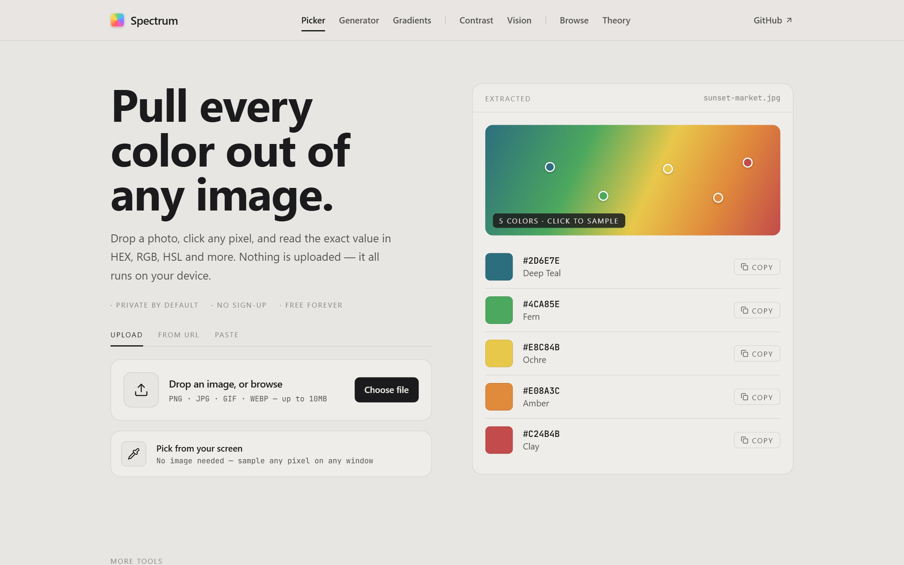

<div align="center">

# Spectrum

### Pick, explore, and transform color.

A client-side color toolkit — sample colors from images, build gradients and palettes, check WCAG contrast, simulate color blindness, and learn color theory. Everything runs in your browser.

[](https://github.com/dominikkoenitzer/Spectrum/actions/workflows/ci.yml)
[](https://spectrum.punds.ch)
[](src/lib/color.test.ts)


**[→ Try it at spectrum.punds.ch](https://spectrum.punds.ch)**




</div>

---

> [!NOTE]
> Spectrum is **100% client-side** — no backend, database, or API. Images you drop in are processed entirely in the browser via the Canvas API and are **never uploaded**; your picked-color history stays in `localStorage`.

## Table of contents

- [Tools](#tools)
- [Tech stack](#tech-stack)
- [Getting started](#getting-started)
- [Scripts](#scripts)
- [Design system](#design-system)
- [Project structure](#project-structure)
- [Deployment & CI/CD](#deployment--cicd)
- [Author](#author)

## Tools

| Tool | What it does |
|---|---|
| 🎯 **Picker** ([`/`](https://spectrum.punds.ch/)) | Drop or paste an image and sample exact colors pixel-by-pixel, with a saved color history |
| 🧪 **Generator** ([`/color-generator`](https://spectrum.punds.ch/color-generator)) | Generate colors and harmonies to build from |
| 🌈 **Gradients** ([`/gradient-maker`](https://spectrum.punds.ch/gradient-maker)) | Compose multi-stop gradients and copy the CSS |
| ◐ **Contrast** ([`/contrast-checker`](https://spectrum.punds.ch/contrast-checker)) | Check foreground/background pairs against **WCAG** thresholds |
| 👁 **Vision** ([`/color-blindness`](https://spectrum.punds.ch/color-blindness)) | Simulate color-vision deficiencies (CVD) to test accessibility |
| 📚 **Browse** ([`/browse`](https://spectrum.punds.ch/browse)) | Explore named colors, palettes, and trending/brand colors by category |
| 🎨 **Theory** ([`/color-theory`](https://spectrum.punds.ch/color-theory)) | Color principles, harmonies, and emotional associations |

Color conversion and math are handled by the framework-agnostic logic in `src/lib/` (built on [`colord`](https://github.com/omgovich/colord)), kept cleanly separate from the React UI.

## Tech stack

- **[Next.js 16](https://nextjs.org/)** (App Router, Turbopack) + **[React 19](https://react.dev/)**
- **[TypeScript 5](https://www.typescriptlang.org/)** (strict) — framework-agnostic color logic in `src/lib/`
- **[Tailwind CSS 4](https://tailwindcss.com/)** with a centralized `@theme` design system
- **[colord](https://github.com/omgovich/colord)** for color conversion · **[lucide-react](https://lucide.dev/)** icons
- **[Vercel](https://vercel.com/)** hosting
- **No backend** — everything is client-side

Package manager: **Bun**.

## Getting started

**Prerequisites:** [Bun](https://bun.sh/) 1.1.39+ (this repo pins `1.3.14` via `.bun-version`). Bun is the runtime and package manager.

```bash
# Clone
git clone https://github.com/dominikkoenitzer/Spectrum.git
cd Spectrum

# Install dependencies
bun install

# Start the dev server → http://localhost:3000
bun run dev
```

No configuration or API keys — Spectrum runs entirely in the browser.

## Scripts

| Command | Description |
|---|---|
| `bun run dev` | Dev server (Turbopack) on [http://localhost:3000](http://localhost:3000) |
| `bun run build` | Production build — the canonical way to verify changes (runs `tsc` + prerenders every route) |
| `bun run start` | Serve the production build |
| `bun run type-check` | `tsc --noEmit` |
| `bun run lint` | ESLint (`eslint-config-next`) |
| `bun run test` | Vitest suite for the colour maths |

> [`src/lib/color.test.ts`](src/lib/color.test.ts) pins the numbers the tool exists to get right: WCAG contrast against the canonical reference pairs (#767676 → 4.5, #595959 → 7.0), ratio symmetry, the AA/AAA thresholds, hue-band totality, and colour-blindness simulation invariants. CI runs typecheck, lint, tests and build on every push and PR.

## Design system

The visual identity is defined centrally in `src/app/globals.css` via Tailwind v4's `@theme`. The concept is **a neutral gallery frame** — the chrome is paper + ink, and the only saturated color on screen is the color you're working with. Semantic tokens (`bg-paper`, `bg-surface`, `text-ink`, `border-line`, …) drive everything; fonts are Hanken Grotesk (display/sans) and JetBrains Mono (color codes). Light theme only.

## Project structure

```
src/
├── app/            # One folder per tool route (page.tsx = 'use client', SEO in sibling layout.tsx)
│                   # /, /browse, /color-generator, /gradient-maker,
│                   # /contrast-checker, /color-blindness, /color-theory, /privacy, /terms
├── components/     # ui/ primitives, color-picker/, layout/ (Header, Footer)
└── lib/            # Framework-agnostic color logic: colorUtils, contrastUtils,
                    # colorBlindness, gradientUtils, canvasUtils, colorData
```

## Deployment & CI/CD

Spectrum is a static site deployed on **[Vercel](https://vercel.com/)** (live at **[spectrum.punds.ch](https://spectrum.punds.ch)**).

GitHub Actions:

- **[`ci.yml`](.github/workflows/ci.yml)** — on every push and pull request to `main`: install, **type-check**, and **build**.
- **[`deploy.yml`](.github/workflows/deploy.yml)** — optional production deploy via the Vercel CLI, gated on the `VERCEL_TOKEN`, `VERCEL_ORG_ID`, and `VERCEL_PROJECT_ID` secrets; a no-op otherwise (Vercel's Git integration handles deploys by default).

[Dependabot](.github/dependabot.yml) keeps Bun and GitHub Actions dependencies current weekly.

## Author

**Dominik Könitzer** — software engineer in Zürich, Switzerland.

[dk.punds.ch](https://dk.punds.ch) · [CV](https://dk.punds.ch/cv) · [@dominikkoenitzer](https://github.com/dominikkoenitzer) · [dominik.koenitzer@gmail.com](mailto:dominik.koenitzer@gmail.com)
